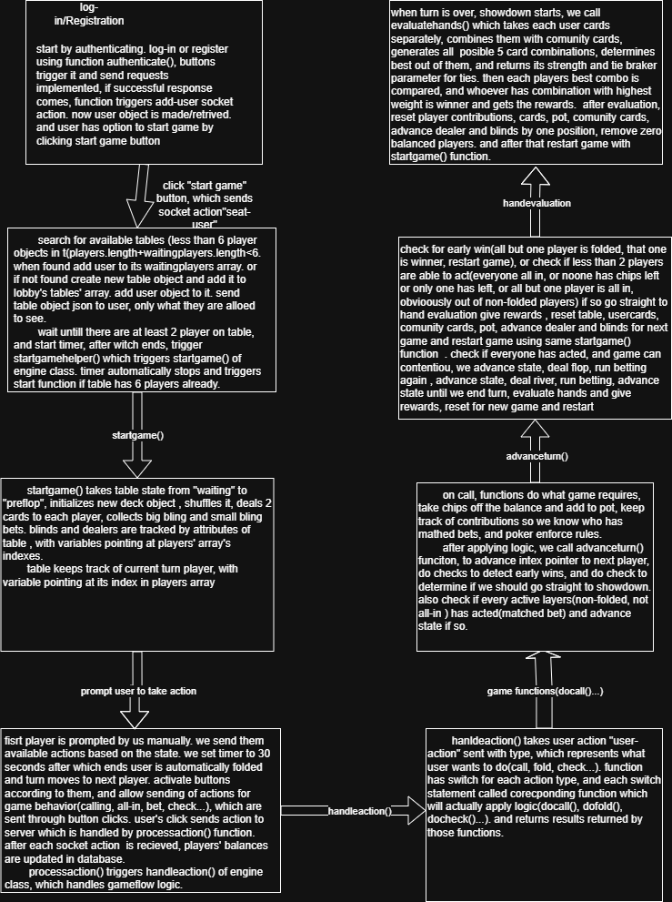

# Poker App — Multiplayer Texas Hold'em

A real-time multiplayer Texas Hold'em poker application built with Node.js and Socket.IO. Players can register, log in, join tables, and play full games with automated turn management, hand evaluation, and persistent balances.

## Tech Stack

- **Backend:** Node.js, Express
- **Real-time:** Socket.IO (WebSockets)
- **Database:** PostgreSQL
- **Authentication:** JWT, bcrypt
- **Architecture:** OOP — Table, Engine, Lobby, Deck, User, Evaluation classes

## How It Works

The game runs entirely server-side with full server authority. Clients send actions, the server validates and processes them, and broadcasts state updates. A state machine manages game flow across preflop, flop, turn, river, and showdown stages.

## Architecture



## Getting Started

### Prerequisites
- Node.js
- PostgreSQL

### Setup

1. Clone the repository
```bash
git clone https://github.com/LipartelianiNiko/Poker-app.git
cd Poker-app/poker-server
```

2. Install dependencies
```bash
npm install
```

3. Create a `.env` file in `poker-server/`:
```
DB_USER=postgres
DB_HOST=localhost
DB_NAME=pokerapp
DB_PASSWORD=yourpassword
DB_PORT=5432
JWT_SECRET=yourjwtsecret
```

4. Create the database and table in PostgreSQL:
```sql
CREATE DATABASE pokerapp;
\c pokerapp
CREATE TABLE users (
    id SERIAL PRIMARY KEY,
    username VARCHAR(15) UNIQUE NOT NULL,
    password TEXT NOT NULL,
    balance INTEGER DEFAULT 1000
);
```

5. Start the server
```bash
node server.cjs
```

6. Open `http://localhost:3000` in your browser

## Known Limitations

- Side pots not implemented — all-in scenarios with multiple players use simplified pot distribution
- Reconnection handling not implemented — disconnecting during a game ends your session
-on refresh, page resets to 

